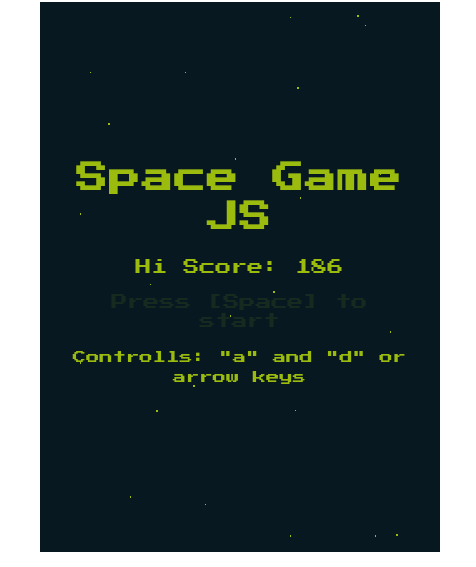

# Space Game :rocket:

A simple space game made with HTML Canvas and vanilla javascript with no dependencies.

## features
- animations with canvas
- requestAnimationFrame loop
- Difficulty progression
- Hi-Scores



# install and Run
clone the repo:

```bash
git clone https://github.com/Bruends/JS_Space_Game.git
```

open `index.html` on your favorite browser and have Fun :)